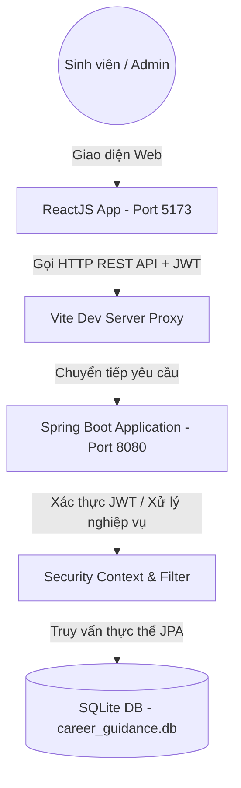
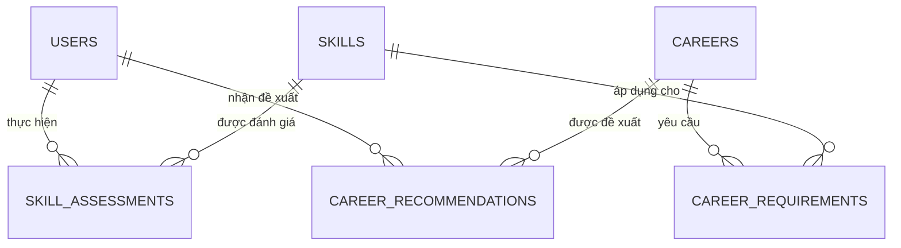

# TÀI LIỆU ĐẶC TẢ YÊU CẦU PHẦN MỀM (SRS)
## DỰ ÁN: CareerPathSE - NỀN TẢNG ĐỊNH HƯỚNG NGHỀ NGHIỆP VÀ LỘ TRÌNH HỌC CÁ NHÂN HÓA

---

## 1. GIỚI THIỆU (INTRODUCTION)

### 1.1 Mục đích
Tài liệu Đặc tả Yêu cầu Phần mềm (SRS) này mô tả chi tiết các yêu cầu chức năng và phi chức năng cho hệ thống **CareerPathSE**. Tài liệu được biên soạn nhằm định hình rõ ràng các nghiệp vụ của hệ thống cho các thành viên phát triển dự án, kiểm thử viên, và làm căn cứ đánh giá môn học Công nghệ Phần mềm.

### 1.2 Phạm vi hệ thống
Hệ thống **CareerPathSE** là một ứng dụng web full-stack hỗ trợ sinh viên ngành Kỹ thuật phần mềm (Software Engineering) và Công nghệ thông tin:
* Tự đánh giá năng lực các kỹ năng kỹ thuật cốt lõi (Core Technical Skills).
* Nhận đề xuất các vị trí nghề nghiệp phù hợp (Backend, Frontend, Fullstack, AI, Mobile...) đi kèm điểm số tương thích (Match Score) và phân tích khoảng cách kỹ năng (Skill Gap Analysis).
* Đề xuất các khóa học tương thích trực tiếp để cải thiện các kỹ năng còn thiếu sót.
* Xây dựng lộ trình học tập cá nhân hóa theo định hướng nghề nghiệp.

### 1.3 Thuật ngữ và viết tắt
| Thuật ngữ / Viết tắt | Định nghĩa / Ý nghĩa |
| :--- | :--- |
| **SRS** | Software Requirements Specification - Đặc tả yêu cầu phần mềm |
| **JWT** | JSON Web Token - Phương thức xác thực an toàn thông qua chuỗi mã hóa |
| **API** | Application Programming Interface - Giao diện lập trình ứng dụng |
| **JPA / Hibernate** | Công nghệ ánh xạ cơ sở dữ liệu quan hệ sang đối tượng trong Java |
| **REST** | Kiến trúc truyền tải trạng thái đại diện sử dụng giao thức HTTP |
| **Match Score** | Điểm số phần trăm tương thích giữa năng lực hiện tại của sinh viên và yêu cầu của nghề nghiệp |

---

## 2. MÔ TẢ TỔNG QUAN (OVERALL DESCRIPTION)

### 2.1 Kiến trúc hệ thống tổng quan
Hệ thống được thiết kế theo kiến trúc Client-Server tách biệt:
* **Frontend**: Phát triển bằng **ReactJS** kết hợp **Vite**, giao diện styled bằng **Vanilla CSS** và **TailwindCSS** hiện đại với hiệu ứng Glassmorphic tối giản.
* **Backend**: Phát triển bằng **Java Spring Boot**, sử dụng **Spring Security** để bảo mật hệ thống thông qua bộ lọc **JwtAuthenticationFilter**.
* **Database**: Sử dụng cơ sở dữ liệu **SQLite** nhúng gọn nhẹ, tương tác qua **Spring Data JPA**.

### 2.2 Các tác nhân hệ thống (Actors)
1. **Sinh viên (Student / User)**: Tác nhân chính. Thực hiện đăng ký, đăng nhập, thực hiện đánh giá kỹ năng, xem báo cáo định hướng, khoảng cách kỹ năng, lộ trình học và danh sách khóa học được đề xuất.
2. **Quản trị viên (Admin)**: Tác nhân quản trị (được cấu hình qua quyền `ROLE_ADMIN` hoặc hệ thống). Có quyền quản lý danh mục kỹ năng, cập nhật thông tin nghề nghiệp và các cấu hình nghiệp vụ của hệ thống.

---

## 3. YÊU CẦU CHỨC NĂNG CHI TIẾT (FUNCTIONAL REQUIREMENTS)

### 3.1 Quản lý tài khoản & Xác thực (Authentication & User Management)
* **Đăng ký tài khoản (Register)**:
  * Cho phép người dùng đăng ký tài khoản mới bằng cách nhập `username`, `password`, `email`, và `fullName`.
  * Ràng buộc hệ thống: `username` và `email` phải là duy nhất, không trùng lặp trong cơ sở dữ liệu.
* **Đăng nhập (Login)**:
  * Xác thực người dùng bằng `username` và `password`.
  * Khi đăng nhập thành công, hệ thống sinh ra một mã token **JWT** bảo mật (có thời hạn 24 giờ). Token này sẽ được lưu ở Client (`localStorage`) và đính kèm vào tiêu đề `Authorization: Bearer <token>` trong các yêu cầu API tiếp theo.
* **Đăng xuất (Logout)**:
  * Xóa token khỏi `localStorage` ở phía Client và đưa người dùng về trạng thái chưa xác thực.
* **Xem và Cập nhật hồ sơ (Profile Management)**:
  * Người dùng đăng nhập có thể xem thông tin cá nhân hiện tại.
  * Cập nhật họ tên (`fullName`) và địa chỉ `email` (với ràng buộc email mới không được trùng lặp).
  * Thay đổi mật khẩu cá nhân (cần xác thực bằng mật khẩu cũ trước khi đổi sang mật khẩu mới).
  * Xóa tài khoản vĩnh viễn khỏi hệ thống.

### 3.2 Đánh giá kỹ năng (Skill Assessment)
* **Quản lý danh sách kỹ năng**:
  * Lưu trữ danh sách các kỹ năng phần mềm phân loại theo danh mục như: *Backend*, *Frontend*, *DevOps*, *Database*...
  * Mỗi kỹ năng có mô tả chi tiết và mức độ thành thạo tiêu chuẩn.
* **Đánh giá năng lực cá nhân (Submit Skill Assessment)**:
  * Cho phép người dùng tự chấm điểm cho từng kỹ năng của mình trên thang điểm `0 - 100` và quy đổi ra cấp độ thành thạo tương ứng từ `1` (Mới bắt đầu) đến `5` (Chuyên gia).
  * Hệ thống ghi nhận kết quả đánh giá, thời gian đánh giá và đưa ra nhận xét phản hồi (`feedback`).
* **Xem thống kê kỹ năng (Skill Summary)**:
  * Cung cấp báo cáo tổng quan: tổng số kỹ năng đã đánh giá, điểm trung bình, và biểu đồ phân bổ số lượng kỹ năng theo từng mảng chuyên môn (Ví dụ: 3 kỹ năng Backend, 2 kỹ năng Frontend).

### 3.3 Khuyến nghị nghề nghiệp (Career Recommendations)
* **Thuật toán so khớp & Đề xuất nghề nghiệp (Recommendation Algorithm)**:
  * Hệ thống so khớp danh mục kỹ năng cá nhân đã đánh giá của người dùng với danh sách yêu cầu tối thiểu của các vị trí công việc (`Career Requirements`).
  * **Công thức tính điểm tương thích (Match Score)**:
    $$\text{Match Score} = \left( \frac{\text{Số kỹ năng bắt buộc đạt yêu cầu}}{\text{Tổng số kỹ năng bắt buộc của nghề}} \right) \times 100\%$$
  * Các kỹ năng tùy chọn (không bắt buộc) đóng vai trò điểm cộng thưởng thêm.
  * Phân loại mức độ tương thích (`Strength`): **HIGH** (Match Score $\ge 80$), **MEDIUM** (Match Score $50 \rightarrow 79$), và **LOW** (Match Score $< 50$).
* **Phân tích khoảng cách kỹ năng (Skill Gap Analysis)**:
  * Liệt kê chi tiết những kỹ năng sinh viên đã đạt chuẩn yêu cầu công việc.
  * Liệt kê cụ thể những kỹ năng sinh viên còn thiếu hoặc chưa đạt đủ cấp độ tối thiểu (Ví dụ: Yêu cầu tối thiểu kỹ năng Docker cấp 3, sinh viên hiện đạt cấp 2 $\rightarrow$ cần nâng cấp).
* **Quản lý khuyến nghị**:
  * Người dùng có thể chủ động lưu trữ (`Archive`) các khuyến nghị nghề nghiệp cũ để làm gọn danh sách theo dõi.

### 3.4 Đề xuất khóa học học tập (Course Recommendations)
* **Gợi ý khóa học theo kỹ năng yếu**:
  * Hệ thống truy vấn tự động các kỹ năng mà sinh viên được đánh giá là yếu hoặc chưa đạt đủ yêu cầu của nghề nghiệp mong muốn.
  * Lọc và gợi ý các khóa học học tập tương thích từ kho cơ sở dữ liệu khóa học liên kết (bao gồm thông tin: Tên khóa học, nhà cung cấp Coursera/Udemy, thời lượng, cấp độ, đường dẫn học tập URL, và nhãn kỹ năng `skillTags`).

---

## 4. YÊU CẦU PHI CHỨC NĂNG (NON-FUNCTIONAL REQUIREMENTS)

### 4.1 Tính bảo mật (Security)
* Tất cả mật khẩu của người dùng đều phải được mã hóa một chiều bằng thuật toán **BCrypt** trước khi lưu vào cơ sở dữ liệu. Không lưu mật khẩu dạng văn bản thuần (plaintext).
* Chống truy cập trái phép bằng cách chặn tất cả các API nghiệp vụ quan trọng (như `/api/users/profile`, `/api/skills/assessments/**`, `/api/careers/recommendations/**`) bằng cấu hình Spring Security, trả về mã trạng thái `403 Forbidden` đối với các yêu cầu không mang token JWT hợp lệ.
* Cơ chế CORS (Cross-Origin Resource Sharing) được cấu hình chuẩn chỉ để cho phép cổng ứng dụng Client (Port 5173) gửi yêu cầu an toàn đến Server (Port 8080).

### 4.2 Hiệu năng (Performance)
* Thời gian phản hồi trung bình của các API xác thực và truy vấn nghiệp vụ nhỏ hơn **500ms** trong điều kiện mạng nội bộ.
* Thuật toán khớp nối khuyến nghị chạy trực tiếp trên bộ nhớ (In-memory matching) giúp tối ưu hóa tốc độ xử lý khi người dùng yêu cầu tính toán lại.

### 4.3 Khả năng bảo trì & Mở rộng (Maintainability & Scalability)
* Sử dụng ORM JPA/Hibernate giúp dễ dàng chuyển đổi hệ quản trị cơ sở dữ liệu từ SQLite sang các hệ cơ sở dữ liệu mạnh mẽ hơn như MySQL hay PostgreSQL trong tương lai mà không cần cấu trúc lại mã nguồn Java.
* Giao diện ReactJS chia tách rõ ràng thành các component tái sử dụng (`AuthPanel`, `UserProfilePanel`, `SkillAssessmentPanel`, `CareerRecommendationPanel`, `CourseRecommendationPanel`).

---

## 5. KIẾN TRÚC DỮ LIỆU VÀ CƠ SỞ DỮ LIỆU (DATABASE SCHEMA)

Cơ sở dữ liệu bao gồm 7 bảng quan hệ chính, được thiết kế đồng bộ với các thực thể JPA trong ứng dụng:

### 5.1 Bảng `users` (Thông tin người dùng)
* Ánh xạ từ thực thể User.java.

| Tên trường (Column) | Kiểu dữ liệu (Type) | Ràng buộc (Constraint) | Mô tả |
| :--- | :--- | :--- | :--- |
| `id` | BIGINT | PRIMARY KEY, AUTOINCREMENT | Khóa chính tự sinh |
| `username` | VARCHAR(255) | UNIQUE, NOT NULL | Tên tài khoản đăng nhập |
| `password` | VARCHAR(255) | NOT NULL | Mật khẩu đã băm BCrypt |
| `email` | VARCHAR(255) | UNIQUE, NOT NULL | Thư điện tử liên hệ |
| `full_name` | VARCHAR(255) | NULLABLE | Họ tên đầy đủ của sinh viên |
| `role` | VARCHAR(255) | DEFAULT 'ROLE_STUDENT' | Vai trò phân quyền hệ thống |

### 5.2 Bảng `skills` (Danh mục kỹ năng)
* Ánh xạ từ thực thể Skill.java.

| Tên trường (Column) | Kiểu dữ liệu (Type) | Ràng buộc (Constraint) | Mô tả |
| :--- | :--- | :--- | :--- |
| `id` | BIGINT | PRIMARY KEY, AUTOINCREMENT | Khóa chính tự sinh |
| `name` | VARCHAR(255) | UNIQUE, NOT NULL | Tên kỹ năng (Ví dụ: Java, React...) |
| `description` | TEXT | NULLABLE | Mô tả nội dung kỹ năng |
| `category` | VARCHAR(255) | NULLABLE | Nhóm kỹ năng (Backend, Frontend...) |
| `proficiency_level` | INTEGER | CHECK (1-5) | Cấp độ thành thạo tham chiếu |
| `created_at` | DATETIME | NULLABLE | Thời gian khởi tạo bản ghi |

### 5.3 Bảng `skill_assessments` (Báo cáo đánh giá kỹ năng của người dùng)
* Ánh xạ từ thực thể SkillAssessment.java.

| Tên trường (Column) | Kiểu dữ liệu (Type) | Ràng buộc (Constraint) | Mô tả |
| :--- | :--- | :--- | :--- |
| `id` | BIGINT | PRIMARY KEY, AUTOINCREMENT | Khóa chính tự sinh |
| `user_id` | BIGINT | FOREIGN KEY -> `users(id)` | Liên kết tới người dùng được đánh giá |
| `skill_id` | BIGINT | FOREIGN KEY -> `skills(id)` | Liên kết tới kỹ năng được đánh giá |
| `score` | INTEGER | CHECK (0-100) | Điểm số tự đánh giá |
| `proficiency_level` | INTEGER | CHECK (1-5) | Cấp độ thành thạo tương ứng |
| `feedback` | TEXT | NULLABLE | Nhận xét phản hồi hoặc ghi chú |
| `status` | VARCHAR(50) | DEFAULT 'PENDING' | Trạng thái (PENDING, COMPLETED, IN_PROGRESS) |
| `assessed_at` | DATETIME | NULLABLE | Thời gian hoàn thành đánh giá |
| `created_at` | DATETIME | NOT NULL | Thời gian tạo bản ghi |
| `updated_at` | DATETIME | NOT NULL | Thời gian cập nhật bản ghi |

### 5.4 Bảng `careers` (Danh mục vị trí nghề nghiệp định hướng)
* Ánh xạ từ thực thể Career.java.

| Tên trường (Column) | Kiểu dữ liệu (Type) | Ràng buộc (Constraint) | Mô tả |
| :--- | :--- | :--- | :--- |
| `id` | BIGINT | PRIMARY KEY, AUTOINCREMENT | Khóa chính tự sinh |
| `title` | VARCHAR(255) | UNIQUE, NOT NULL | Tên chức danh nghề nghiệp (Backend Dev...) |
| `description` | TEXT | NULLABLE | Mô tả chi tiết về công việc |
| `responsibilities` | TEXT | NULLABLE | Các trách nhiệm chính trong vai trò |
| `requirements` | TEXT | NULLABLE | Các yêu cầu chung khác |
| `seniority` | VARCHAR(50) | NULLABLE | Cấp bậc công việc (ENTRY_LEVEL, MID, SENIOR) |
| `salary_range` | VARCHAR(100) | NULLABLE | Dải thu nhập tham khảo |
| `experience_years_required` | INTEGER | NULLABLE | Số năm kinh nghiệm tối thiểu yêu cầu |
| `created_at` | DATETIME | NULLABLE | Thời gian tạo vị trí nghề nghiệp |

### 5.5 Bảng `career_requirements` (Mối quan hệ yêu cầu kỹ năng của từng nghề nghiệp)
* Ánh xạ từ thực thể CareerRequirement.java.

| Tên trường (Column) | Kiểu dữ liệu (Type) | Ràng buộc (Constraint) | Mô tả |
| :--- | :--- | :--- | :--- |
| `id` | BIGINT | PRIMARY KEY, AUTOINCREMENT | Khóa chính tự sinh |
| `career_id` | BIGINT | FOREIGN KEY -> `careers(id)` | Liên kết tới công việc |
| `skill_id` | BIGINT | FOREIGN KEY -> `skills(id)` | Liên kết tới kỹ năng yêu cầu |
| `min_proficiency_level` | INTEGER | CHECK (1-5) | Cấp độ thành thạo tối thiểu bắt buộc |
| `mandatory` | BOOLEAN | NOT NULL | `true`: kỹ năng bắt buộc / `false`: khuyến khích |

### 5.6 Bảng `career_recommendations` (Khuyến nghị nghề nghiệp gửi tới người dùng)
* Ánh xạ từ thực thể CareerRecommendation.java.

| Tên trường (Column) | Kiểu dữ liệu (Type) | Ràng buộc (Constraint) | Mô tả |
| :--- | :--- | :--- | :--- |
| `id` | BIGINT | PRIMARY KEY, AUTOINCREMENT | Khóa chính tự sinh |
| `user_id` | BIGINT | FOREIGN KEY -> `users(id)` | Liên kết tới tài khoản sinh viên |
| `career_id` | BIGINT | FOREIGN KEY -> `careers(id)` | Liên kết tới công việc được gợi ý |
| `match_score` | INTEGER | CHECK (0-100) | Điểm số tương thích phần trăm khớp |
| `analysis` | TEXT | NULLABLE | Phân tích lý do đề xuất hệ thống đưa ra |
| `matched_skills` | TEXT | NULLABLE | Các kỹ năng sinh viên đã đáp ứng |
| `skills_to_improve` | TEXT | NULLABLE | Các kỹ năng cần cải thiện thêm |
| `strength` | VARCHAR(50) | NULLABLE | Độ mạnh của khuyến nghị (HIGH, MEDIUM, LOW) |
| `status` | VARCHAR(50) | DEFAULT 'ACTIVE' | Trạng thái khuyến nghị (ACTIVE, ARCHIVED) |
| `created_at` | DATETIME | NOT NULL | Ngày khởi tạo đề xuất |
| `updated_at` | DATETIME | NOT NULL | Ngày cập nhật đề xuất |

### 5.7 Bảng `courses` (Danh mục khóa học kết nối đề xuất)
* Ánh xạ từ thực thể Course.java.

| Tên trường (Column) | Kiểu dữ liệu (Type) | Ràng buộc (Constraint) | Mô tả |
| :--- | :--- | :--- | :--- |
| `id` | BIGINT | PRIMARY KEY, AUTOINCREMENT | Khóa chính tự sinh |
| `title` | VARCHAR(255) | NOT NULL | Tên khóa học |
| `description` | TEXT | NULLABLE | Giới thiệu nội dung bài học |
| `provider` | VARCHAR(255) | NULLABLE | Nhà cung cấp (Coursera, Udemy...) |
| `level` | VARCHAR(50) | NULLABLE | Độ khó khóa học (Beginner, Intermediate...) |
| `duration` | VARCHAR(100) | NULLABLE | Thời gian học ước tính |
| `url` | VARCHAR(500) | NULLABLE | Đường dẫn liên kết trực tiếp tới khóa học |
| `skill_tags` | TEXT | NULLABLE | Danh sách các tag kỹ năng tương ứng (phân tách dấu `,`) |
| `created_at` | DATETIME | NULLABLE | Ngày cập nhật khóa học vào hệ thống |
